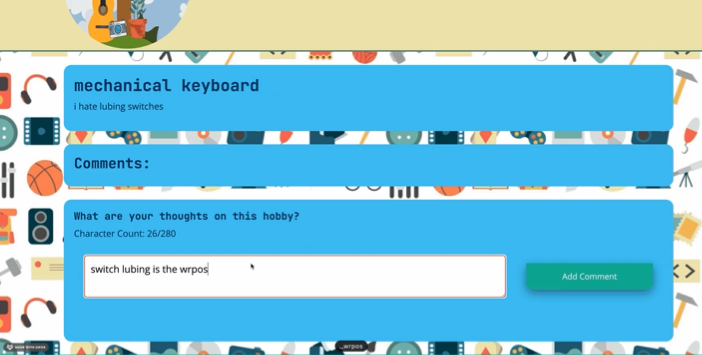

# Hobbist-Place-on-Earth

## Description 📖

MERN-stack single-page application, with a scalable MongoDB back end, a GraphQL API, and an Express.js and Node.js server with a React front end, implementing user authentication with JWT to build a user-focused platform.

## Getting Started 💃

Create a Interactive MERN Stack Single-Page Application with the following features:

✅Use React for the front end.

✅Use GraphQL with a Node.js and Express.js server.

✅Use MongoDB and the Mongoose ODM for the database.

✅Use queries and mutations for retrieving, adding, updating, and deleting data.

✅Be deployed using Heroku (with data).

✅Have a polished UI.

✅Be responsive.

✅Be interactive (i.e., accept and respond to user input).

✅Include authentication (JWT).

✅Protect sensitive API key information on the server.

✅Have a clean repository that meets quality coding standards (file structure, naming conventions, best practices for class and id naming conventions, indentation, high-quality comments, and so on).

✅Have a high-quality README (with unique name, description, technologies used, screenshot, and link to deployed application).

# User story ✏️

№1

AS A USER  if I am not logged in 
I WANT to be able to look at a list of hobbies -OR-view a list of a hobby categories SO I MAY read about them.

 

 

№2

AS A USER I have an option to login or signUp BECAUSE  
I WANT to  build 
a profile so that through my account I may add categories and hobbies that become associateD with my profile.

№3

AS A USER when I’m logged in 
I WANT to ADD commentS TO other hobbies so that I may share my experienceS with others.

№4
AS A USER when I’m logged in 
I WANT to JOIN AN EXISTING HOBBY

# Built With ⚙️

 [Mongodb](https://www.mongodb.com/)

[Express](https://expressjs.com/)

[React](https://react.dev/)

[Nodejs](https://nodejs.org/en)

[Graphql](https://graphql.org/)

[Heroku](https://id.heroku.com/login)

[Tailwind](https://tailwindcss.com/)

[Mongoose](https://www.npmjs.com/package/mongoose)

[Sweetalerts](https://sweetalert2.github.io/)

[Coolors](https://coolors.co/)

# Installation 🤖

To install the project follow these steps:

💾 Clone down project repo

In the project directory, you can run:

🏃-npm install

🏃-npm run build

Builds the app for production to the build folder.
It correctly bundles React in production mode and optimizes the build for the best performance.

The build is minified and the filenames include the hashes.
Your app is ready to be deployed!

🏃-npm run develop

# Usage & Installation 🤖

The URL of the functional, deployed application(heroku)

The URL of the GitHub repository. Give the repository a unique name and include a README describing the project

https://github.com/j-pohahau5/Hobbist-Place-on-Earth

## Authors 💣

** OUR TEAM **  

💻- [Alex Horning](https://github.com/makeitouthill)

💻- [Emil Ronquillo](https://github.com/Emil1577)

💻- [Henner Espinoza](https://github.com/justhenner)

💻- [Jonathan Pohahau](https://github.com/j-pohahau5)

💻- [Roksolana Odynak](https://github.com/poucoLouco)

# License 📑

